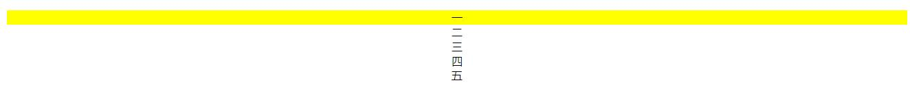
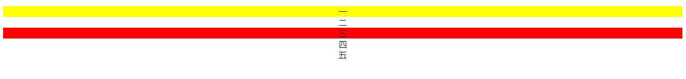
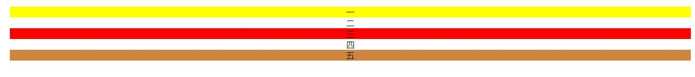
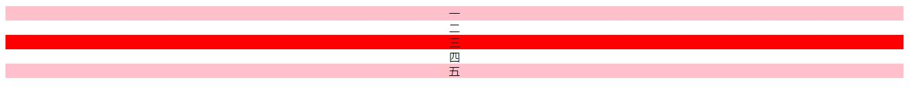
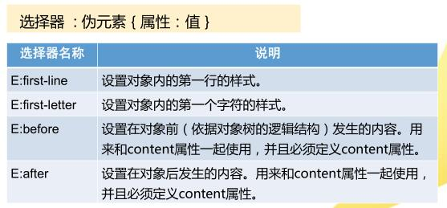
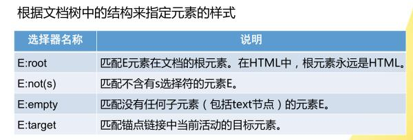
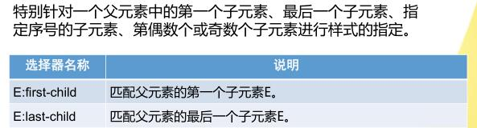
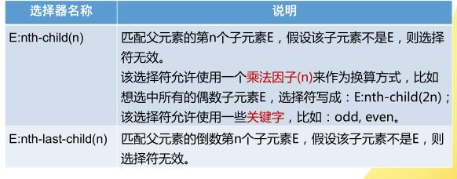

# CSS3概述及选择器

### 概述
#### CSS3特点
* 向下兼容
* 新属性
* 不断完善中
* 模块化

#### 兼容性
	-moz-： Firefox的替代用法  
	-webkit- ： Safari和Chrome的替代用法

### 选择器
#### 属性选择器
* `[name="yi"]`：选择name属性值为"yi"的元素(不一定是name属性)

例  
html

	<ul style="text-align: center;list-style-type: none;">
		<li name="yi">一</li>
		<li>二</li>
		<li name="woshisan">三</li>
		<li>四</li>
		<li name="xiaowubuku">五</li>
	</ul>

css

	[name="yi"]{
		background-color:yellow;
	}

* `[name^="woshi"]`：选择具有name属性并且属性值是以"woshi"开头的字符串的元素

例

	li[name^="woshi"]{
		background-color:red;
	}

* `[name$="buku"]`：选择具有name属性且属性值是以"buku"结尾的字符串的元素

例

	[name$="buku"]{
		background-color:peru;
	}

* `name*="i"`：选择具有name属性且属性值是包含"i"的字符串的元素

例

	[name*="i"]{
		background-color:pink;
	}

#### 结构性伪类选择器

例

	[name*="san"]:before{
		content:'我是一个before';
	}

例

	li:nth-child(3){
		background-color:red;
	}

注意：是匹配其父元素的第几个子元素