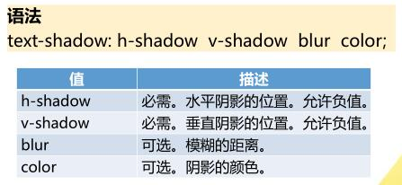
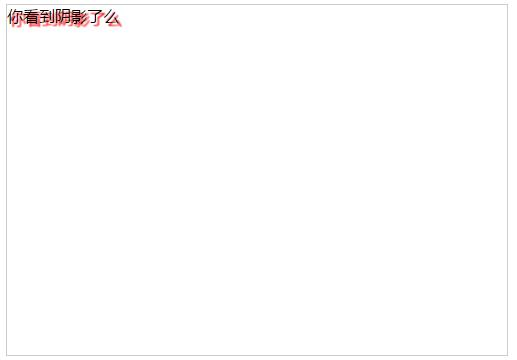
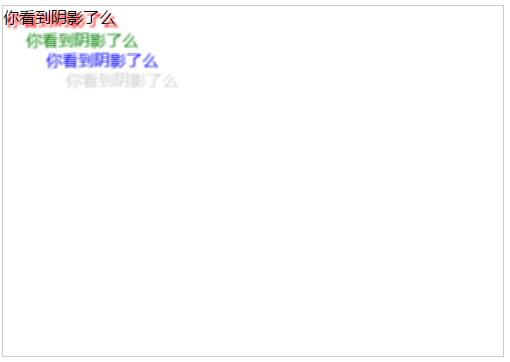
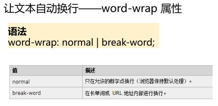
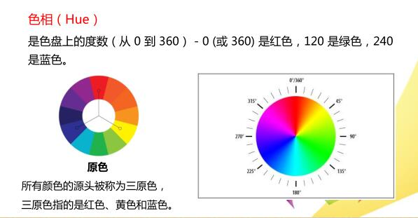
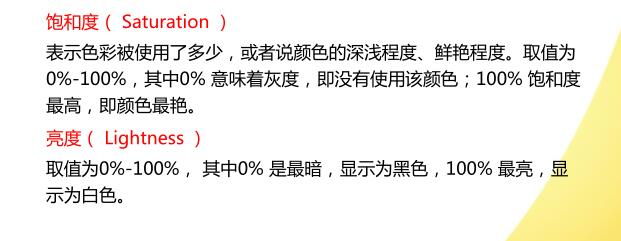

# 文本、字体与颜色

### 文本样式
#### `text-shadow`属性  

例

html

	

		你看到阴影了么
	

css

	div{
		width:500px;
		height:350px;
		border:1px solid #ccc;
	}
	span{
		text-shadow:3px 3px 1px red;
	}

可以使用`text-shadow`属性来给文字指定多个阴影，并且针对每个阴影使用不同颜色，多个阴影使用逗号分隔

css

	div{
		width:500px;
		height:350px;
		border:1px solid #ccc;
	}
	span{
		text-shadow:3px 3px 2px red,
					23px 23px 2px green,
					43px 43px 2px blue,
					63px 63px 2px #ccc;			
	}

#### 文本自动换行 `word-wrap`属性

[参考链接，点我打开](http://www.cnblogs.com/2050/archive/2012/08/10/2632256.html)

### 字体样式
考试不考，先占个位，有空补充

### 颜色样式
CSS3新增了3中颜色值定义模式：RGBA颜色值、HSL颜色值、HSLA颜色值  

RGBA颜色值是RGB颜色值的扩展，带有一个透明度通道  
`rgba(red,green,blue,<opacity>)`  
opacity参数是介于0.0(完全透明)与1.0(完全不透明)的数字

HSL色彩模式是工业界的一种颜色标准，通过对色相(Hue)，饱和度(Saturation)和亮度(Lightness)3个颜色通道的变化以及它们相互之间的叠加来获得各种颜色  
`hsl(hue,saturation,lightness)`

亮度为50%时，正常

HSLA只是比HSL多了一个透明度通道