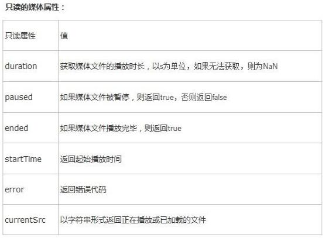
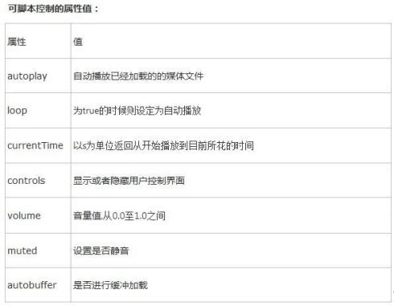
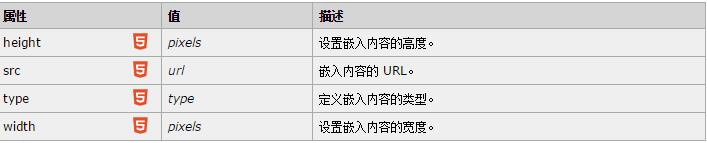

# HTML5标签及特性
### H5标准
* 结构标签：简化某些标签，加入新标签，优化原有网页结构
* 功能标签：提供给javascript程序一些新的API，以实现一些新的功能  
好处：有利于搜索引擎和爬虫等程序抓取网页
#### 新增的结构标签
<header\>：定义头部，通常包含导航和一些引导信息  
<footer\>：定义页脚  
<nav\>：定义导航内容  
<article\>:定义正文内容  
<aside\>：定义边栏内容  
<section\>：定义文章中的段

#### 新增的功能元素
<video\>：播放视频  
<audio\>：播放音频  
<embed\>：定义嵌入的内容，比如插件  
<time\>：定义公历的时间（24小时制）或日期 &nbsp;&nbsp;&nbsp;&nbsp;&nbsp;&nbsp;&nbsp;在浏览器不会显示特殊效果，方便机器、爬虫、搜索引擎

相关属性：  
 src：指定音视频文件的URL地址  
`<audio src="au_1.mp3">请更新浏览器！</audio>`  
  
controls：是否添加浏览器自带的播放控制条  
`<audio src="au_1.mp3" controls="controls">请更新浏览器！</audio>`
  
loop：是否循环播放音视频  
`<audio src="au_1.mp4" loop="loop">请更新浏览器！</audio>`
  
autoplay：指定媒体是否在页面加载后自动播放  
`<audio src="au_1.mp3" autoplay="autoplay">请更新浏览器！</audio>`    
以上属性两个标签均支持  

width：指定视频宽度，只有<video\>标签具有  
`<audio src="au_1.mp3" width="100px">请更新浏览器！</audio>`
 
height：指定视频高度，只有<video\>标签具有  
`<audio src="au_1.mp3" height="20px">请更新浏览器！</audio>`  

##### 音视频格式兼容性解决方案
	<audio controls="controls">
		<source src="au_2.mp3" type="audio/mp3"></source>
		<source src="au_2.ogg" type="audio/ogg"></source>
		请更新浏览器！
	</audio>
注释：<video\>标签同上，浏览器执行的时候将按照顺序进行判断，选择第一个支持的格式，如果都不支持则显示"请更新浏览器！"

相关API：  
play()：加载音视频  
pause()：暂停处于播放状态的音视频  
load()：重新载入媒体进行播放  

举个例子：  
html:

	<h1>刚好遇见你——李玉刚</h1>
    <audio controls="controls" id="ganghao">
      	<source src="ganghao.mp3" type="audio/mpeg">
    </audio>
js:

    	var ganghao=document.getElementById("ganghao");
    	var zanting=document.getElementById("zanting");
    	zanting.onclick=function(){
			ganghao.pause();
		}

更多的API：

其它新增功能元素  
<embed\>：

<time\>:  
`发布时间：<time>11:13</time>`  
`<time datetime="2017-5-30">端午节，我的生日</time>`