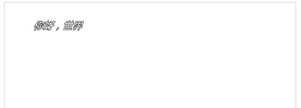

# 画布(二)

### 线条的属性
* lineWidth属性：设置或返回当前线条的宽度，以像素计
* lineCap属性：设置线条末端线冒的样式

lineCap的可选属性值  

##### lineCap的可选属性值的效果展示（具体观察三根线条末端的不同）

html

	<canvas id="mycanvas" width="500" height="500" style="border:1px solid #ccc">
		您的浏览器不支持canvas元素，请更新浏览器重试！
	</canvas>

js

		var e=document.getElementById("mycanvas");
		var context=e.getContext("2d");
		context.beginPath();
			context.moveTo(100,50);
			context.lineTo(100,450);
			context.strokeStyle="yellow";
			context.stroke();
		context.closePath();
		
		context.beginPath();
			context.moveTo(400,50);
			context.lineTo(400,450);
			context.strokeStyle="yellow";
			context.stroke();
		context.closePath();
		
		context.beginPath();
			context.moveTo(100,100);
			context.lineTo(400,100);
			context.strokeStyle="red";
			context.lineCap="butt";
			context.lineWidth="3";
			context.stroke();
		context.closePath();
		
		context.beginPath();
			context.moveTo(100,200);
			context.lineTo(400,200);
			context.strokeStyle="red";
			context.lineCap="round";
			context.lineWidth="3";
			context.stroke();
		context.closePath();
		
		context.beginPath();
			context.moveTo(100,300);
			context.lineTo(400,300);
			context.strokeStyle="red";
			context.lineCap="square";
			context.lineWidth="3";
			context.stroke();
		context.closePath();

* lineJoin属性：设置当两条线交汇时所创建的边角的类型  

lineJoin属性可选的值

miterLimit属性：设置最大斜接长度  
斜接长度指的是在两条线交汇处内角和外角之间的距离，只有当lineJoin属性为"miter"时,miterLimit才有效

如果斜接长度超过miterLimit的值，边角会以lineJoin的"bevel"斜角类型来显示

#### 图像变换和状态保存
##### 图形变换
画布的转换指的是转换画布的坐标系

* 平移：translate(x,y)

转换画布的用户坐标系统，重新映射画布上的(0,0)位置  
参数x：坐标原点沿水平方向的偏移量  
参数y：坐标原点沿垂直方向的偏移量  
translate()平移会累加
  
	context.translate(300,100);

* 旋转：rotate(deg)  
旋转画布的坐标系统  
参数angle:旋转角度，以弧度计。正值表示顺时针方向旋转，负值表示逆时针方向旋转  
角度转换为弧度：  
(角度/180)*Math.PI  
rotate()旋转会累加

		context.rotate(1.5*Math.PI);

* 缩放：scale(sx,sy)  
缩放当前绘图至更大或更小  
缩放通过独立的水平(参数sx)和垂直(参数sy)的缩放因子来完成。  
例如，传递一个值2.0和0.5将会导致绘图路径宽度变为原来的两倍，而高度变为原来的一半  
如果对绘图进行缩放，所有之后的绘图也会被缩放，定位也会被缩放,scale()缩放会累加

例

		context.beginPath();
			context.moveTo(50,50);
			context.lineTo(50,200);
			context.lineJoin="bevel";
			context.lineWidth="2";
			context.stroke();
		context.closePath();
	
		context.scale(2,0.5);   //缩放前没有此条语句
	
		context.beginPath();
			context.moveTo(70,50);
			context.lineTo(50,200);
			context.lineJoin="bevel";
			context.lineWidth="2";
			context.stroke();
		context.closePath();

缩放前  

缩放后(缩放语句后面的坐标系根据参数进行缩放)

#### 状态的保存和恢复
save()：保存当前canvas绘图环境的所有属性、坐标变换等信息形成一份拷贝  
restore()：将绘图环境状态恢复为保存值  
可以嵌套式的调用save()和restore()方法  

		context.save();
		context.scale(1,1);
		context.strokeRect(50,50,100,100);
		context.restore();
		
		context.save();
		context.scale(2,2);
		context.strokeRect(50,50,100,100);
		context.restore();
		
		context.save();
		context.scale(3,3);
		context.strokeRect(50,50,100,100);
		context.restore();

效果  
  

分析：保存的永远都是最开始的状态 所以就相当于把一个`context.strokeRect(50,50,100,100);`分别缩放1、2、3倍 ，而不是*2 *4 *8...那样的

#### 文本的渲染
##### 文本属性
* font属性：设置画布上文本内容的当前字体属性(与CSS font属性相同)
* textAlign属性(可选属性值：center、left、right、start、end)：设置文本对齐方式  
* textBaseline属性(可选属性值：top、middle、bottom)：设置在绘制文本时的当前文本基线

##### 绘制填充文字
* fillText(text,x,y[,maxWidth])方法  
在画布上绘制填色的文本，文本的默认颜色是黑色  

例

		context.font="italic bold 20px '微软雅黑'";
		context.fontAlign="center";
		context.textBaseline="bottom";
		context.fillText("你好，世界",60,60);

##### 绘制轮廓文字
* strokeText(text,x,y[,maxWidth])方法  
在画布上绘制文本（无填充色）  
  

		context.font="italic bold 20px '微软雅黑'";
		context.fontAlign="center";
		context.textBaseline="bottom";
		context.strokeText("你好，世界",60,60);

##### 测量文字宽度
* measureText(text)方法  
返回一个对象，该对象包含测量当前所绘制文字中指定文字的宽度

		context.font="italic bold 20px '微软雅黑'";
		context.fontAlign="center";
		context.textBaseline="bottom";
		var o=context.strokeText("你好，世界！",60,60);
		var m=context.measureText(o);
		alert(m.width);

