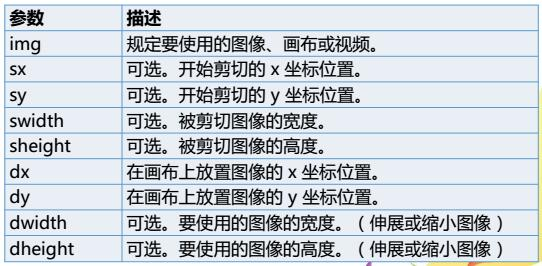
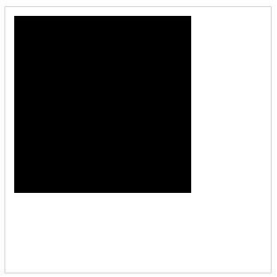

# 画布（三）

### 图像处理
#### 绘制图像
在HTML5中，不仅可以使用canvas API来绘制图形，还可以使用读取磁盘或网络中的图像文件，然后使用canvas API将该图像绘制在画布中

#### 绘图
`drawImage()`方法用于在画布上绘制图像或视频  
参数详解：  

注意：参数中的img 是Image对象  

注意：需要在图片加载完成之后才能绘制图片

语法一：在画布上定位图像

		var e=document.getElementById("mycanvas");
		var context=e.getContext("2d");
		var img=new Image();
		img.src="img8.jpg";
		img.onload=function(){
			context.drawImage(img,50,50);
		}

语法二：在画布上定位图像，并规定图像的宽度和高度(即 进行缩放)

		var e=document.getElementById("mycanvas");
		var context=e.getContext("2d");
		var img=new Image();
		img.src="img8.jpg";
		img.onload=function(){
			context.drawImage(img,50,50,500,300);
		}

语法三：剪切图像，并在画布上定位被剪切的部分(即 进行剪切和缩放)

		var e=document.getElementById("mycanvas");
		var context=e.getContext("2d");
		var img=new Image();
		img.src="img8.jpg";
		img.onload=function(){
			context.drawImage(img,0,0,500,100,50,50,500,300);
		}

#### 绘制视频
只需将Image对象换为Video对象，仅对当前正在播放视频的帧进行描绘

### 像素级操作
#### 像素操作——ImageData对象
canvas是逐像素进行渲染的  
canvas中提供了强大的像素处理方法，据此我们可以对图片进行复杂的处理，包括改变图片的透明度、图片反色、图片高亮、剪切、复制等操作

##### ImageData对象为画布上指定的矩形像素数据  
属性：  
width：ImageData对象的宽度，以像素计  
height：ImageData对象的高度，以像素计

#### 像素
属性：data  
data属性返回一个数组，该数组包含指定的ImageData对象的图像数据  
ImageData对象中的每个像素，都存在着四方面的信息，即RGBA值，数组中每四个数据代表一个像素的信息  
R —— (0-255)  
G —— (0-255)  
B —— (0-255)  
G ——透明度 (0-255)

#### 创建ImageData对象
`createImageData(width,height)`  
创建新的空白ImageData对象，新对象的默认像素值为rgba(0,0,0,0)

`createImageData(imageData)`  
创建与指定的另一个ImageData对象尺寸相同的新的ImageData对象(不会复制图像数据)

#### 返回ImageData对象
`getImageData(x,y,width,height)`  
返回ImageData对象，该对象拷贝了画布指定矩形的像素数据

`putImageData(imgData,x,y)`  
把指定的ImageData对象的图像数据放回画布的指定位置上

看不懂，没关系，结合着下面的例子来看

HTML

		<canvas id="myCanvas" width="300" height="300" style="border:1px solid #d3d3d3;">
			Your browser does not support the HTML5 canvas tag.
		</canvas>

JS

			var c=document.getElementById("myCanvas");
			var ctx=c.getContext("2d");
			var imgData=ctx.createImageData(200,200);
			for (var i=0;i<imgData.data.length;i+=4)
			  {
			  imgData.data[i+0]=0;
			  imgData.data[i+1]=0;
			  imgData.data[i+2]=0;
			  imgData.data[i+3]=255;
			  }
			ctx.putImageData(imgData,10,10);

效果如图  

