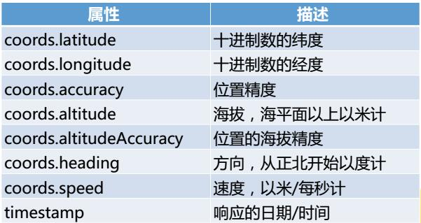
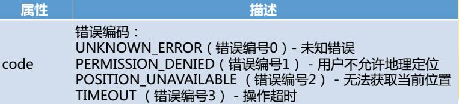

# 地理位置定位
### geolocation API用来实现地理位置定位
window对象下面的navigator对象包含有关浏览器的信息  
geolocation对象包含在navigator对象中

geolocation对象能获得信息包括：纬度、经度、精确度、海拔、行驶方向、速度

#### 检测浏览器的兼容性（即 检测浏览器是否支持geolocation对象）

	if(navigator.geolocation){
		//等会要放的代码
	}
	else
		alert("您的浏览器不支持！");

#### API中的三个方法
1.getCurrentPosition：获取当前地理位置  
2.watchPosition：持续监视当前地理位置  
3.clearWatch：清除监视

#### getCurrentPosition(参数1，参数2，参数3)  
参数1：获取数据成功后执行的回调函数  
参数2（可选）：获取数据失败时执行的回调函数  
参数3（可选）：可选参数列表    

#### 参数1——成功回调函数：  
获取定位信息成功时getCurrentPosition()返回一个position对象给成功回调函数，此对象包含以下属性  

	function getLocation(position){
		alert("您当前的纬度是："+position.coords.latitude);
	}
	if(navigator.geolocation){
		navigator.geolocation.getCurrentPosition(getLocation);
	}
	else
		alert("您的浏览器不支持！");

注意：getCurrentPosition方法的三个参数只写相关函数的函数名即可

#### 参数2——错误回调函数：
定位过程中受设备情况、网络状况、用户授权等多方面影响，经常获取不到位置数据，所以错误回调函数非常必要

获取定位信息失败时getCurrentPosition()返回一个error对象给失败回调函数，此对象包含如下属性：  

	function getLocation(position){
		alert("您当前的纬度是："+position.coords.latitude);
	}
	function noGetLocation(error){
		if(error.code==1)
			alert("靠,用户居然不允许地理位置请求！");
	}
	if(navigator.geolocation){
		navigator.geolocation.getCurrentPosition(getLocation,noGetLocation);
	}
	else
		alert("您的浏览器不支持！");

也可以使用switch 和 case 的配合

	switch(error.code){
		case 1:
			errorDiv.innerHTML="位置服务被拒绝"
			break;
		case 2:
			errorDiv.innerHTML="暂时获取不到位置信息"
			break;
		case 3:
			errorDiv.innerHTML="获取信息超时"
			break;
		case 0:
			errorDiv.innerHTML="未知错误"
			break;
	}

#### 参数3——options可选参数列表
option参数支持三个可选参数，为：enableHighAccuracy, timeout, maximumAge   
1. enableHighAccuracy参数：表示是否高精度可用，为Boolean类型，默认为false，如果开启，响应时间会变慢，同时，在手机设备上会用掉更多的流量，也就是money了。  
2. timeout参数：表示等待响应的最大时间，默认是0毫秒，表示无穷时间。  
3. maximumAge参数：表示应用程序的缓存时间。单位毫秒，默认是0，意味着每次请求都是立即去获取一个全新的对象内容。

	navigator.geolocation.watchPosition(showPosition, showError, {enableHighAccuracy:true,timeout:0,maximumAge:1000});

### watchPosition(参数1，参数2，参数3)
参数同getCurrentPosition  
不同的是，它会持续监测用户位置，只要位置发生变化立即调用参数1(成功回调函数)

	function getLocation(position){
		alert("您当前的纬度是："+position.coords.latitude);
	}
	if(navigator.geolocation){
		var my_id=navigator.geolocation.watchPosition(getLocation);
	}
	else
		alert("您的浏览器不支持！");

### 清除监视 clearWatch(watchID)
html

	<button id="stop">停止</button>

js
	
	function getLocation(position){
		alert("您当前的纬度是："+position.coords.latitude);
	}
	if(navigator.geolocation){
		var my_id=navigator.geolocation.watchPosition(getLocation);
	}
	else
		alert("您的浏览器不支持！");
		
		
	var stop=document.getElementById("stop");
	stop.onclick=function(){
		clearWatch(my_id);
	}    

[参考资料](http://www.zhangxinxu.com/wordpress/2011/06/%E6%B5%8F%E8%A7%88%E5%99%A8%E5%9C%B0%E7%90%86%E4%BD%8D%E7%BD%AEgeolocation-api-%E7%AE%80%E4%BB%8B/)
