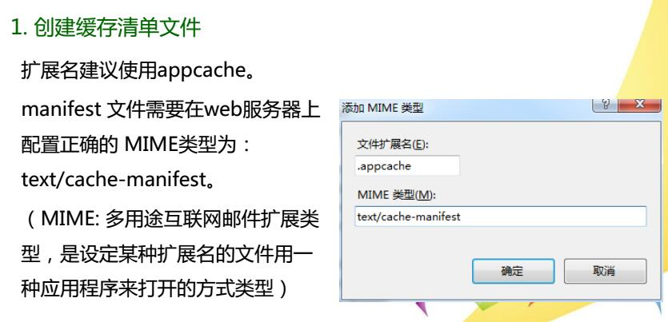
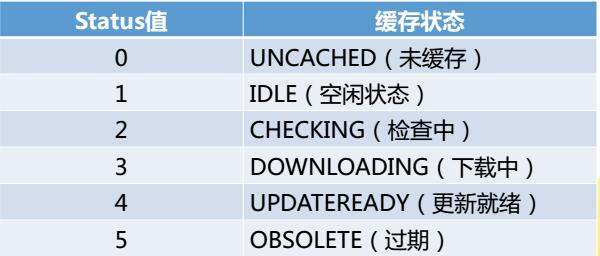
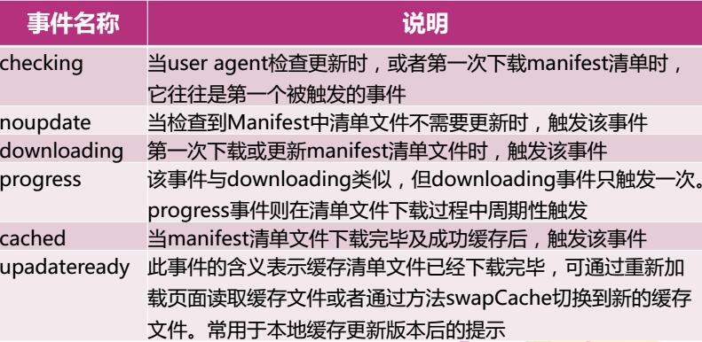
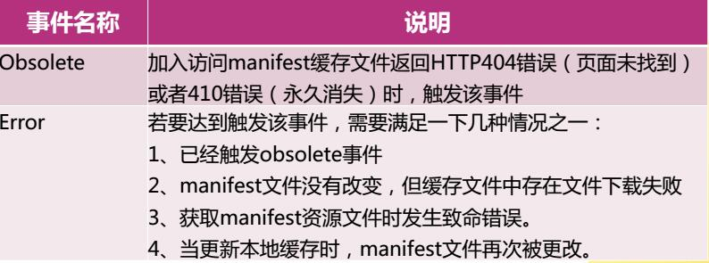
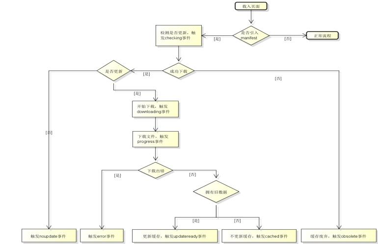

# 离线Web应用
#### 优点：  
程序总是从网络请求，可以实时更新程序  
#### 缺点：
  
* 加载完页面后突然断网，刷新页面后内容没有了
* 在新窗口重新访问该页面，在断网状态下打开的还是原来页面

#### 什么样的应用适合：
只需要偶尔进行网络通信的应用   如印象笔记，邮件系统，博客发布平台等

#### 理想状态的Web应用：  
在线时获得最新的应用  
在本地存储应用资源，无论是否在线都可以使用应用

#### 离线Web应用的作用：  
离线浏览：用户可以在应用离线时使用它们  
加快速度：已缓存资源加载得更快  
减少服务器负载：浏览器只从服务器下载更新过或修改过的资源

#### 本地缓存与浏览器网页缓存的区别：
本地缓存是为整个Web应用程序服务的，只缓存指定的网页，本地缓存是可靠的，可控制的

#### 离线应用的实现方式
将Web应用所使用的资源（HTML、CSS、JS、图片等文件）缓存在浏览器本地

#### 实现离线应用涉及到的技术
##### 缓存清单文件：
管理要缓存的文件列表

由于练习的时候服务器就是本机 所以我打算这么做  
① 创建一个后缀名为.appcache的文件  比如:manifest.appcache
  
② 配置manifest文件
manifest文件可分为三个部分  
CACHE MANIFEST  
在此标题下列出的文件将在首次下载后进行缓存，写在第一行，必须有该部分  
NETWORK  
在此标题下列出的文件需要与服务器连接，且不会被缓存  
FALLBACK  
提供了获取不到缓存资源时的备选资源路径  
注：  
引入manifest文件的html页面可以在CACHE MANIFEST中省略  
可以使用*表示其它所有资源/文件  

③ 在html标记中指定使用缓存文件  
`<html manifest="manifest.appcache">`

#### 构建离线应用后，即使在线状态，用户也会访问缓存文件，所以说及时更新用户的缓存文件非常重要
##### 离线缓存更新的方法：
用户清空浏览器缓存  
manifest文件被修改  
由程序来更新应用缓存（API）

## API
系统在window对象下提供了用于离线控制的 applicationCache对象  
applicationCache对象代表本地缓存，可用它来通知用户本地缓存已经被更新，也允许用户手动更新本地缓存

#### 浏览器兼容性检测

	window.onload=function(){
		if(window.applicationCache){
			//离线操作API
		}
		else 
			alert("快去更新浏览器！");
	}

#### 获取缓存的状态
`window.applicationCache.status`  
会有六种可能值

#### applicationCache缓存对象事件

#### 离线事件监听
在实际的应用中，可以通过事件监听，并根据当前applicationCache对象的状态处理相关业务  

事件监听 `applicationCache.addEventListener()`

	applicationCache.addEventListener("checking", function(){
		msg.innerHTML+="checking ";
	}, true);
	
	applicationCache.addEventListener("noupdate", function() {
		msg.innerHTML+="noupdate ";
	}, true);
	
	等等...

#### 利用API更新缓存方法
1.调整当前应用资源下载过程 `applicationCache.update()`  
2.更新到最新的缓存，不会使之前加载的资源突然被重新加载 `applicationCache.swapCache()`

html

	
页面内容

	<button id="update">更新</button>

js

	window.onload = function(){
		document.getElementById("update").onclick = function(){
			applicationCache.update();
			//window.location.reload();
			window.history.go(0);
		}
	}

