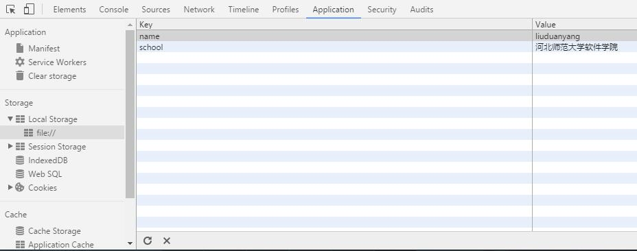

# Web存储

### Web存储的优点（相比于Cookie）
* 存储空间更大，浏览器至少提供5M的空间
* 数据仅仅存在本地，不会自动向服务器发送
* 提供丰富的接口，方便的操作数据
* 独立的存储空间，每个域都有各自存储空间，不会造成混乱

### Web存储提供了两种存储机制
## LocalStorage
将数据保存在客户端本地的硬件设备中，即使浏览器被关闭了，该数据仍然存在，下次打开浏览器访问网站时仍然可以继续使用

## Session Storage
将数据保存在session对象中，session是指用户在浏览某个网站时，从进入网站到浏览器关闭所经过的这段时间。session对象可以用来保存在这段时间内所有要求保存的任何数据。当用户关闭浏览器窗口后，数据会被删除

#### 即，sessionStorage为临时保存，而localStorage为永久保存

### Web Storage用法
数据的组织形式：键值对  
HTML5存储是基于键值对的形式存储的，每个键值对成为一个项(item)。存储和检索数据都是通过指定的键名，键名的类型是字符串类型，键值可以是包括字符串、布尔值、数值在内的任意javascript支持的类型，但最终数据是以字符串类型存储的

### localStorage使用方法
先判断下浏览器是否支持

		if(!window.localStorage){
			alert("不支持！");
		}

存储数据项有两种方法  
方法一

		localStorage.setItem("name","liuduanyang");

方法二

		localStorage['school']="河北师范大学软件学院";

按Fn+F12 查看效果如下

读取数据项也对应着有两种方法（alert只是为了方便显示）   
方法一

		alert(localStorage.getItem('name'));

方法二

		alert(localStorage['name']);

删除数据项（将指定的某个数据项删除）

		localStorage.removeItem('name');

清除全部数据

		localStorage.clear();

获得键名（key（）内参数的值是0开始的数据项编号，先放入的数据排在前面）

		alert(localStorage.key(0));

例如

		localStorage.clear();
		localStorage['a1']='b1';
		localStorage['a2']='b2';
		localStorage['a3']='b3';
		alert(localStorage.key(0));
		alert(localStorage.key(1));
		alert(localStorage.key(2));

结果是：a1 a2 a3

获得数据项的个数

		alert(localStorage.length);

### sessionStorage使用方法
同localStorage
