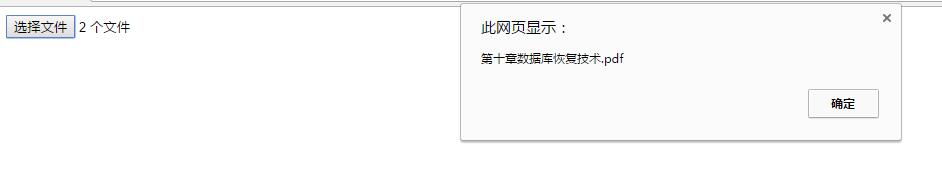
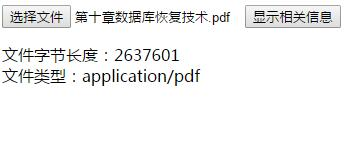
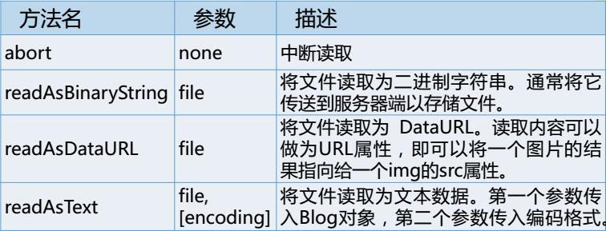
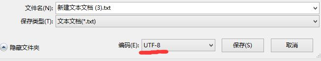

# 文件

### HTML5文件操作特点
* HTML5提供了功能强大的文件操作API，可以完成选中多个文件、读取文件内容等功能  
* 能够突破沙箱访问本地的文件系统，从而有效的弥补桌面和web应用之间的鸿沟

### file对象和fileList对象
* file对象指用户选择的文件；fileList对象表示用户选择的文件列表
* 在HTML4中，file控件内只允许放置一个文件，HTML5通过添加multiple属性，在file控件内允许一次放置多个文件。每一个文件都是一个file对象，而fileList对象则为这些file对象的列表，代表用户选择的所有文件
* file对象有两个属性，name属性表示文件名，不包括路径；lastModifiedDate属性表示文件的最后修改日期

设置input标签，用来上传文件，在标签内添加multiple属性来设置一次可上传多个文件

	<input type="file" multiple id="file_a"/>

所有type属性为file的`<input>`元素都有一个files属性，用来存储用户所选择的文件。files有一个length属性和item方法，可以通过files[index]或者files.item(index)获取选择的file对象

根据上面的`<input>`标签写js代码

	var file_aa=document.getElementById("file_a");
	file_aa.onchange=function(){
		alert(file_aa.files[0].name);
	}

达到效果：选择一个或多个文件，然后弹出第一个选择的文件的文件名  
如图所示

也可以用lastModifiedDate属性获取文件的最后修改日期

### Blob对象的属性
Blob对象表示二进制原始数据  
#### Blob对象的属性和方法
* size属性 表示一个Blob对象的字节长度
* type属性 表示Blob的MIME类型，如果是未知类型，则返回一个空字符串
* slice()方法 可以访问到字节内部的原始数据块

#### file对象继承了Blob对象 所以Blob对象这些属性可以通过file对象调用

例  
HTML

	<input type="file" multiple id="file_a"/>
	<button id="show">显示相关信息</button>
	

		文件字节长度： 
		文件类型：
	

js

	var file_aa=document.getElementById("file_a");
	var show=document.getElementById("show");
	var show_p=document.getElementById("show_p");
	var show_length=document.getElementById("show_length");
	var show_type=document.getElementById("show_type");
	show.onclick=function(){
		show_p.style.display="block";
		show_length.innerHTML=file_aa.files[0].size;
		show_type.innerHTML=file_aa.files[0].type;
	}

效果如下

选择前  

选择后  

作用举例  
可以用过类型(type属性)过滤文件  
比如，对于图像类型的文件，Blob对象的type属性都是以"image/"开头的，后面紧跟图像的类型  
类似的，比如  
音频文件的type属性：audio/*    
视频文件的type属性：video/*  
图片文件的type属性：image/*  
利用此特性可以判断用户选择的文件是否为某特定类型文件，如果在批量上传时，只允许上传该类型文件，可以利用此属性

### FileReader对象
使用FileReader对象，web应用程序可以异步的读取存储在用户计算机上的文件（或者原始数据缓冲）内容，可以使用File对象或者Blob对象来指定所要处理的文件或数据

#### 检测浏览器是否支持FileReader
支持这一接口的浏览器有一个位于window对象下的FileReader构造函数，如果浏览器有这个构造函数，那么就可以new一个FileReader的实例来使用

	if(window.FileReader){
		//可以正常使用
		var reader=new FileReader();
	}
	else{
		alert("不支持！");
	}

#### FileReader对象的方法
FileReader对象用来把文件读入内存，并且读取文件中的数据 
 
无论读取成功或失败，方法不会返回读取结果，只存储在FileReader对象的result属性中  

#### FileReader对象的事件
当FileReader对象读取文件时，会伴随一系列事件，它们表示读取文件时不同的读取状态

例： 

HTML

	<input type="file" multiple id="file_form"/>
	<button id="show_file">显示文本</button>
	

JS

	document.getElementById("show_file").onclick=function(){
		var file_target=document.getElementById("file_form").files[0];
		var reader=new FileReader();
		reader.readAsText(file_target);
		reader.onloadend=function(){
			var show_p=document.getElementById("show_p");
			show_p.innerHTML=this.result;
		}
	}

实现效果，当上传一个文本文件(默认为utf-8格式，可以设置)时，点击按钮，会将其中的文本内容显示在`
`标签内  

开始检验  
我们事先编辑一个文本文件

保存格式

上传文件并点击按钮  

撒花，谢谢夸奖~
