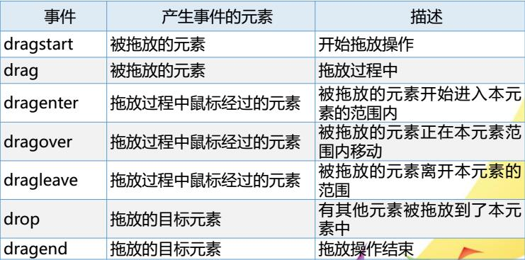
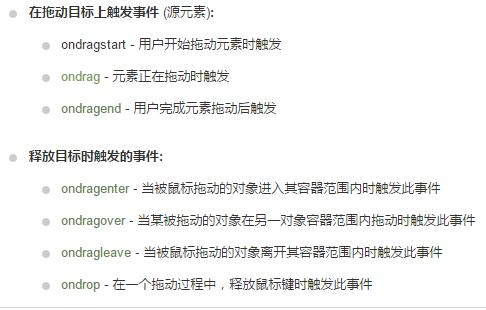

# 拖放

拖放是一种常见的特性，即抓取对象以后拖到另一个位置。在HTML5中，拖放是标准的一部分，任何元素都能拖放。

### 事件对象(event)
在触发DOM上的某个事件时，会产生一个事件对象(event)  
事件对象中包含所有与事件有关的信息，包括导致事件的元素、事件的类型、键盘按键状态、鼠标的位置等。  
在事件处理函数执行时，事件对象将会由浏览器自动传递给事件处理函数。  
事件处理函数中，声明形参接收该参数。  
preventDefault() 用于取消事件的默认动作

### DataTransfer对象
DataTransfer 拖拽数据传递对象  
DataTransfer 为事件对象(event)的一个属性，用于从被拖拽元素向放置目标传递字符串格式的数据。只能在拖放事件的事件处理程序中访问，可以使用此对象的属性和方法来完善拖放功能。

### DataTransfer对象的方法
setData(MIME类型,目标文件的id)  
getData(MIME类型)  

注：现在支持拖动处理的MIME类型有：text/plain(文本文字)、text/html、text/xml、text/uri-list（url列表，每个url为一行）

### DataTransfer对象的属性
types属性 表示存入数据的种类  
dropEffect属性 表示拖放操作的视觉效果

### 实现拖放的步骤
两个步骤：  
(1)将需要拖放的对象元素的draggable属性设为true，即draggable="true"  
注：img元素和a元素(必须制定href属性)默认允许拖放
``  
(2)编写与拖放有关的事件处理代码

#### 拖放相关的事件  前面都加on

另一种总结

##### 基本设置：
先设置元素允许拖动
``  

然后使用ondragstart事件和setData()方法  
拖动时触发拖动事件ondragstart，调用drag_img(event)事件处理函数，在该函数中设定了被拖动元素的数据。
		
		function drag_img(e){
			e.dataTransfer.setData("Text",e.target.id);
			//e.dataTransfer.setData("Text","img1"); 这样也可以
		}

元素放置的位置  
默认无法将元素放置到其它元素中，如果需要设置允许放置，必须阻止对元素的默认处理方式(即调用event对象下的preventDefault()方法)  
先准备一个用于存放拖拽对象(图片)的div
    
	

	

然后编写函数

		function allowDrop(e){
			e.preventDefault();
			//取消默认事件处理
		}

进行放置  
获取到要放置的元素 将其添加到当前元素内部

		function drop(e){
			e.preventDefault();
			var data=e.dataTransfer.getData("Text");
			e.target.appendChild(document.getElementById(data));
		}

例  
HTML 

	

	

JS

		function drag_img(e){
			e.dataTransfer.setData("Text",e.target.id);
		}
		function allowDrop(e){
			e.preventDefault();
			//取消默认事件处理
		}
		function drop(e){
			e.preventDefault();
			var data=e.dataTransfer.getData("Text");
			e.target.appendChild(document.getElementById(data));
		}

