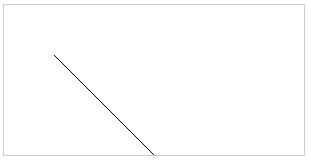
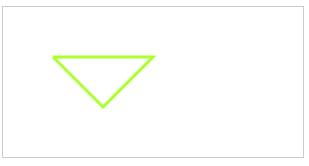
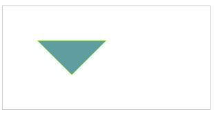
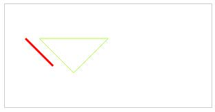
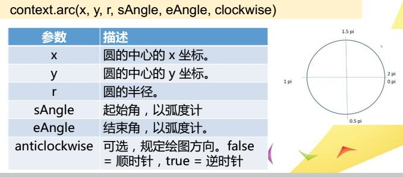
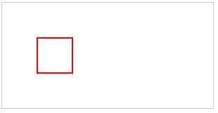
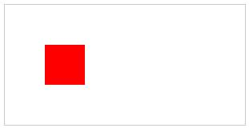
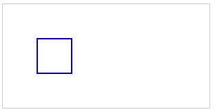
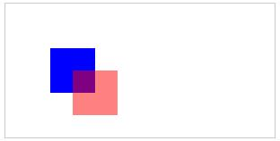
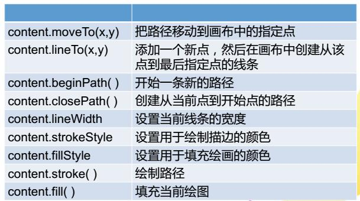

# 画布（一）

###### 画布内容较多，所以分为三个部分  

HTML5中canvas元素用于绘制图形。canvas元素只是一块无色透明的图形容器区域，需要利用Javascript脚本来完成绘画

画布是一个空白矩形区域，可以控制其每一像素

可以通过多种方式使用canvas绘制路径、矩形、圆形、字符以及添加图像
### 创建canvas

	<canvas id="mycanvas" width="300" height="150">
		您的浏览器不支持canvas元素，请更新浏览器重试！
	</canvas>

canvas元素大小可以改变，默认大小是300*150

建议直接设置width和height属性，同时改变canvas元素的大小和元素绘图表面的大小。如果通过css来设定，则只会改变canvas的大小，不会影响到绘图表面。当canvas元素的大小和绘图表面的大小不一致时，浏览器会对绘图表面进行缩放，使其符合元素的大小。

在设置canvas的宽度和高度时，不推荐使用 px 后缀

#### 解析canvas和context的大小
canvas元素实际上有两套尺寸，一套是元素本身(canvas)的大小，另一套是元素绘图表面(context)的大小

当直接设置width和height属性时，实际上是改变了canvas元素的大小和元素绘图表面的大小

而通过css来设定，则只会改变canvas的大小，不会影响到绘图表面

当canvas元素的大小和绘图表面的大小不一致时，浏览器会对绘图表面进行缩放，使其符合元素的大小。

#### getContext()方法
使用`<canvas>`元素需要调用getContext()方法  
getContext()方法可返回一个对象，该对象提供了用于在画布上绘图的方法和属性。cantext被称为绘图环境对象，包含绘图的上下文环境

	var e=document.getElementById("mycanvas");
	var context=e.getContext("2d");

注意，getContext()方法可以接受两个值：2d和3d，分别表示二维和三维

#### 绘制直线、多边形
canvas画布是一个二维网格  
canvas坐标原点为(0,0),位与canvas画布的左上角 从原点向右为X轴的正方向，从原点向下为Y轴的正方向

`MoveTo(x,y)`方法把路径移动到画布中的指定点，此时不创建线条  
`lineTo(x,y)`添加一个新点，然后在画布中创建从该点到最后指定点的线条
`stroke()`方法实际的绘制出通过`MoveTo(x,y)`和`lineTo(x,y)`方法定义的路径，默认颜色是黑色

### *canvas是基于状态的绘图*

比如画一条直线  
HTML

	<canvas id="mycanvas" width="300" height="150">
		您的浏览器不支持canvas元素，请更新浏览器重试！
	</canvas>

JS

	var e=document.getElementById("mycanvas");
	var context=e.getContext("2d");
	context.moveTo(50,50);
	context.lineTo(150,150);
	context.stroke();

效果如下(为了方便显示 我给canvas加了一个边框)

#### 对线条样式进行设置
* lineWidth属性：设置当前线条的宽度，以像素计
* strokeStyle属性：设置用于绘制描边的颜色

例

	var e=document.getElementById("mycanvas");
	var context=e.getContext("2d");
	context.moveTo(50,50);
	context.lineTo(150,150);
	context.lineWidth='5';
	context.strokeStyle="deeppink";
	context.stroke();

注意：`context.lineWidth='5'`和`context.strokeStyle="deeppink"`语句要放到`context.stroke()`语句的前面，因为 *canvas是基于状态的绘图*

画一个三角形

	var e=document.getElementById("mycanvas");
	var context=e.getContext("2d");
	context.moveTo(50,50);
	context.lineTo(100,100);
	context.lineTo(150,50);
	context.lineTo(50,50);
	context.lineWidth='3';
	context.strokeStyle="greenyellow";
	context.stroke();

#### 填充
`fill()`方法填充当前绘图路径，默认颜色是黑色  
如果路径未关闭，那么`fill()`方法会自动从路径结束点到开始点之间添加一条线，以关闭该路径，然后填充该路径

fillStyle 用于设置填充绘画的颜色

建议先填充再描边

例

	var e=document.getElementById("mycanvas");
	var context=e.getContext("2d");
	context.moveTo(50,50);
	context.lineTo(100,100);
	context.lineTo(150,50);
	context.lineTo(50,50);
	context.lineWidth='1';
	context.strokeStyle="greenyellow";
	context.fillStyle="cadetblue";
	context.fill();
	context.stroke();

#### 路径的结束与建立
`beginPath()`表示开始一条新的路径（一条路径的开始），丢弃任何当前定义的路径并且开始一条新的路径。它把当前的点设置为 (0,0)

`closePath()`表示创建从当前点到开始点的路径（一条路径的结束），创建从当前点到开始点的路径

如

	context.moveTo(50,50);
	context.lineTo(100,100);
	context.lineTo(150,50);
	context.lineWidth='1';
	context.strokeStyle="greenyellow";
	context.closePath();
	context.stroke();
		
	context.beginPath();		
	context.moveTo(30,50);
	context.lineTo(70,90);
	context.lineWidth="3";
	context.strokeStyle="red";
	context.stroke();

#### 绘制弧和圆
`arc()`方法用于创建弧线、曲线(用于创建圆或部分圆)  
`context.arc(x,y,r,sAngle,eAngle,anticlockwise);`  

例

	var e=document.getElementById("mycanvas");
	var context=e.getContext("2d");
	context.lineWidth="2";
	context.strokeStyle="red";
	context.arc(100,75,50,0,2*Math.PI);
	context.stroke();

例

	var e=document.getElementById("mycanvas");
	var context=e.getContext("2d");
	context.lineWidth="2";
	context.strokeStyle="red";
	context.arc(100,75,50,0,1.5*Math.PI);
	context.stroke();

仔细观察二者的不同

#### 绘制矩形
`cxt.rect(x,y,width,height)`  
x,y指定矩形左上角的位置  
width,height声明矩形尺寸  
与fill()和stroke()搭配  

##### 涉及到的方法
`rect(x,y,width,height)`:规划出矩形路径  
`fillRect(x,y,width,height)`:绘制填充矩形  
`strokeRect(x,y,width,height)`:绘制矩形的边框  
`clearRect(x,y,width,height)`:清除指定的区域的像素  

分别举例

	context.lineWidth="2";
	context.strokeStyle="red";
	context.rect(50,50,50,50);

	context.fillStyle="red";
	context.fillRect(50,50,50,50);

	context.lineWidth="2";
	context.strokeStyle="blue";
	context.strokeRect(50,50,50,50);

##### 透明度的设置
globalAlpha属性：设置绘图的当前透明值

	context.fillStyle="blue";
	context.fillRect(50,50,50,50);
	context.closePath();
	context.beginPath();
	context.fillStyle="red";
	context.globalAlpha=0.5;
	context.fillRect(75,75,50,50);	

#### 小结
